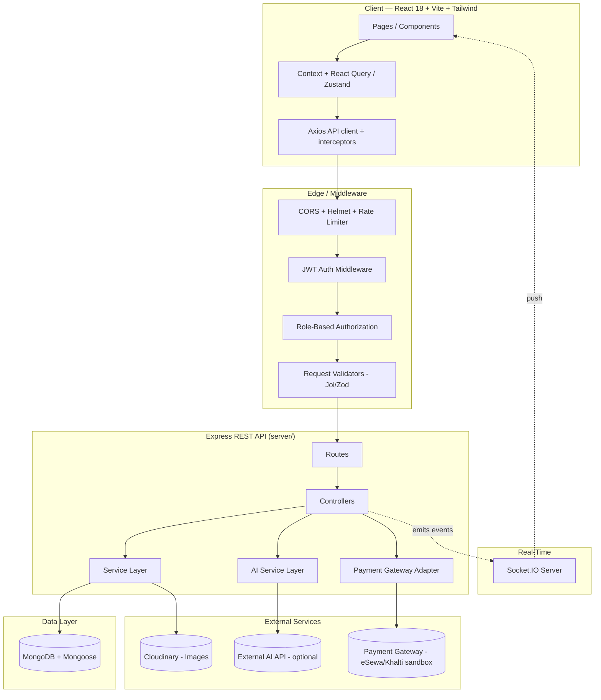
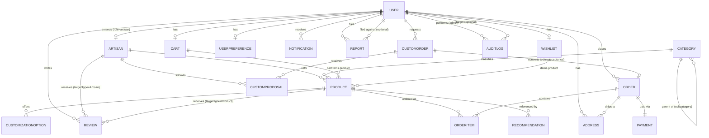

# JuttaX — AI-Powered Local Handmade Footwear Marketplace
### Architecture & Planning Document (Pre-Implementation)

> **Status:** Planning phase. No implementation code has been written yet.
> This document is the output of the architecture/planning stage only.
> Implementation begins when Phase 1 is explicitly requested.

---

## 1. Project Overview

**JuttaX** is a MERN-stack marketplace that connects local, handmade-footwear
artisans directly with customers. It is not a generic shoe store — it merges
four things into one platform:

1. **E-commerce** — browse, search, filter, cart, checkout, order tracking.
2. **Artisan marketplace** — every verified artisan gets a public shop/profile,
   analogous to a mini-storefront ("Ram's Handmade Footwear").
3. **Customization & bespoke production** — customers can customize an
   existing product (style/color/material/sole/personalization) with
   server-calculated pricing, or submit a fully custom shoe request that an
   artisan turns into a proposal and then tracks through real production
   stages (not generic "shipped/delivered" states).
4. **AI-assisted discovery** — a real, content-based recommendation engine
   (with an optional pluggable external AI API layer), a smart size
   estimator, and an artisan-facing AI listing assistant that only ever
   *suggests* — humans approve everything before it's published.

**Primary actors:** Customer, Artisan (must be admin-verified before selling),
Admin (single platform-wide role).

**Non-negotiable engineering rules baked into this architecture:**
- Server is the source of truth for all prices (base price, customization
  surcharge, custom-order price) — the client never dictates a price that is
  persisted.
- Every protected resource is authorized both by authentication (is this a
  valid user?) and by ownership/role (is this *their* resource?). An artisan
  can never read or mutate another artisan's orders/products/analytics.
- "AI" only refers to code paths backed by an actual algorithm or an actual
  external API call gated behind `AI_API_KEY`. Nothing labeled AI is
  hard-coded or faked.
- Secrets (JWT secret, DB URI, Cloudinary, AI key, payment keys) live only in
  environment variables, never in source.

---

## 2. System Architecture

### 2.1 High-level component diagram



### 2.2 Request lifecycle

```
Client (Axios) → CORS/Helmet → Rate limiter → JWT auth → Role guard
  → Ownership guard (resource-level) → Validator (schema) → Controller
  → Service (business logic, price calc, stock checks) → Mongoose Model
  → MongoDB → Response (consistent envelope) → Client
```

Side effects (order created, custom proposal accepted, artisan verified,
etc.) are emitted as **domain events** from the service layer, which:
1. Write a `Notification` document for the affected user(s).
2. Emit a Socket.IO event to that user's room (`user:<id>`) for real-time
   delivery if they're online.

### 2.3 Why these choices

| Decision | Reasoning |
|---|---|
| Layered `routes → controllers → services → models` | Keeps controllers thin (HTTP concerns only); business rules (pricing, stock, authorization edge-cases) live in services and are unit-testable without an HTTP layer. |
| Server-side price calculation for customization & custom orders | Prevents the classic e-commerce vulnerability of trusting client-submitted totals. |
| Content-based recommendation first, external AI API as an optional adapter | Guarantees the app has *real* working recommendations without depending on a paid/rate-limited external API; the AI API layer is additive, not load-bearing. |
| Cloudinary for images | Offloads storage/CDN/resizing; keeps the Node server stateless (easier to deploy/scale). |
| Socket.IO scoped to per-user rooms | Avoids broadcasting all notifications to all clients; simple to reason about and secure. |
| Pluggable payment adapter interface | Nepal-focused gateways (eSewa/Khalti) can be swapped or added without touching order/checkout logic — checkout only talks to a `PaymentProvider` interface. |
| JWT (access token) over server sessions | Stateless auth scales horizontally without a shared session store; refresh handled via short-lived access token + rotation on the client. |
| MongoDB/Mongoose over SQL | Natural fit for flexible, artisan-defined customization schemas (e.g. arbitrary customization option sets per product) and nested/denormalized read-heavy documents (product cards, order snapshots). |

---

## 3. User-Role Permission Matrix

Legend: ✅ full access · 🟡 own resources only · 🔒 admin approval required · ❌ no access

| Capability | Customer | Artisan | Admin |
|---|---|---|---|
| Register / Login / Logout | ✅ | ✅ (extra artisan application step) | N/A (seeded/created) |
| Edit own profile | ✅ | ✅ | ✅ |
| Browse/search/filter products | ✅ | ✅ | ✅ |
| View artisan public profile | ✅ | ✅ | ✅ |
| Create/manage own shop profile | ❌ | 🟡 | 🔒 verifies |
| Submit artisan verification request | ❌ | ✅ (once, then status-tracked) | 🔒 approves/rejects |
| Create/edit/delete products | ❌ | 🟡 (own only) | 🔒 approve/reject/remove any |
| Manage own inventory & pricing | ❌ | 🟡 | ✅ (oversight) |
| Add to cart / wishlist | ✅ | ❌ (artisans shop as customers via same account is out of scope for v1) | ❌ |
| Use Shoe Customizer | ✅ | ❌ | ❌ |
| Submit custom shoe request | ✅ | ❌ | ❌ |
| Respond with custom proposal | ❌ | 🟡 (requests addressed to them) | ❌ |
| View/update production stage | ✅ (view own) | 🟡 (update own custom orders) | ✅ (view all) |
| Place orders / pay | ✅ | ❌ | ❌ |
| View own orders | ✅ | ❌ | ✅ (all) |
| Manage orders containing own products | ❌ | 🟡 | ✅ (all) |
| Write product/artisan review | ✅ (verified purchase only) | ❌ | 🔒 moderates |
| Receive reviews | ❌ | 🟡 (own products/shop) | N/A |
| View own analytics | ❌ | 🟡 | ✅ (platform-wide) |
| Manage categories | ❌ | ❌ | ✅ |
| Manage users (suspend, roles) | ❌ | ❌ | ✅ |
| Handle complaints/reports | ✅ (submit own) | ✅ (submit own) | ✅ (resolve all) |
| Moderate reviews | ❌ | ❌ | ✅ |
| View audit logs | ❌ | ❌ | ✅ |
| Platform settings | ❌ | ❌ | ✅ |

**Enforcement model:** every mutating route runs `authenticate → authorize(roles)
→ loadResource → assertOwnership(resource, req.user)` before the controller
body executes. Ownership checks compare `resource.artisan` /
`resource.customer` against `req.user._id`, never trusting an ID passed in
the URL/body alone.

---

## 4. Complete Module Breakdown

| # | Module | Key Backend Pieces | Key Frontend Pieces |
|---|---|---|---|
| 1 | Auth & Authorization | `auth` routes/controller, JWT + bcrypt, refresh flow, forgot/reset password (email token), `authMiddleware`, `roleMiddleware` | Login, Register, Forgot/Reset Password, Protected Route wrapper, Auth Context |
| 2 | Artisan Marketplace | `artisans` routes, Artisan model, verification workflow, public shop aggregation (products + rating + reviews) | Artisan Marketplace listing, Artisan Profile page |
| 3 | Product Marketplace | `products` routes, Product model, image upload via Cloudinary, admin approval gate | Add/Edit Product forms, Product cards |
| 4 | Product Discovery | Server-side query builder (filters, `$text` search or Atlas Search, pagination via `limit/skip` or cursor) | Shop page with filter sidebar, sort, pagination controls |
| 5 | Product Details | Aggregated product + artisan + reviews + similar/recommended | Product Details page, Image gallery |
| 6 | Shoe Customizer | `customizations` routes, `CustomizationOption` model (artisan-defined per product), server-side price engine | Interactive customizer UI with live price breakdown |
| 7 | Custom Shoe Request | `custom-orders` routes, `CustomOrder` model, reference image upload | Custom Request form (multi-step) |
| 8 | Custom Proposal & Production Tracking | `CustomProposal` model, stage enum + transition guard, `custom-orders/:id/stage` PATCH | Proposal review UI, Production Timeline component |
| 9 | AI Recommendation System | `recommendations` service: content-based scoring (category/material/color/price-range/artisan affinity) + optional external AI adapter | "Recommended for you", "Similar Shoes", "Based on Wishlist" sections |
| 10 | Smart Size Recommendation | `sizing` service comparing foot length/width/fit to product size chart | Size widget on Product Details / Customizer |
| 11 | AI Product Assistant (Artisan) | `ai/product-assist` endpoint, image/text → suggested attributes (draft only, never auto-saved) | "Suggest with AI" button in Add Product form, editable suggestion panel |
| 12 | Cart & Checkout | `cart`, `orders` routes; stock + price re-validation at order creation; Mongo transaction | Cart page, Checkout page, Order confirmation |
| 13 | Order Management | Status enum + transition rules; artisan-scoped queries | Orders list/detail (customer & artisan variants) |
| 14 | Wishlist | `wishlist` routes | Wishlist page, "move to cart" |
| 15 | Reviews & Ratings | `reviews` routes; eligibility check against completed `Order`/`OrderItem` | Review form, review list, star rating component |
| 16 | Notifications | `Notification` model, Socket.IO namespace/rooms | Notification bell/dropdown, real-time toast |
| 17 | Artisan Analytics | Aggregation pipelines on `Order`/`OrderItem`/`Product` scoped to `artisan: req.user._id` | Artisan Analytics dashboard with charts |
| 18 | Admin Dashboard | Platform-wide aggregations, moderation endpoints, `AuditLog` writes on every admin mutation | Admin Dashboard, Users, Verification queue, Moderation views |

---

## 5. MongoDB Collections & Relationships

### 5.1 Entity-relationship diagram



### 5.2 Collections and their purpose

| Collection | Purpose | Notable fields |
|---|---|---|
| **User** | All accounts (customer/artisan/admin share one collection, discriminated by `role`) | `name, email (unique), passwordHash, role[customer\|artisan\|admin], status[active\|suspended], isEmailVerified, avatarUrl` |
| **Artisan** | Extends a `role: artisan` User with shop data | `user (ref, unique)`, `shopName, bio, location, yearsOfExperience, specialization[], verificationStatus[pending\|approved\|rejected], verificationDocs[], ratingAvg, ratingCount` |
| **Category** | Product taxonomy, supports nesting | `name (unique), slug, parent (ref self, optional), icon` |
| **Product** | A listed footwear item | `artisan (ref), category (ref), name, description, brand, material, colors[], sizesAvailable[], soleType, price, stock, images[], isHandmade, isCustomizable, productionTimeDays, tags[], status[pending\|approved\|rejected\|archived], ratingAvg, ratingCount` |
| **CustomizationOption** | Artisan-defined customization choices for a product (style/color/material/sole/personalization) with a price delta | `product (ref), type[style\|color\|material\|sole\|personalization], label, priceDelta, isActive` |
| **CustomOrder** | Fully bespoke shoe request from a customer | `customer (ref), targetArtisan (ref, optional), shoeType, size, footMeasurements{length,width}, preferredColor, material, sole, designDescription, budget, requiredDate, referenceImages[], status[submitted\|design_review\|proposal_sent\|approved\|in_production\|ready\|shipped\|delivered\|rejected\|cancelled], productionStage (enum, see Module 8)` |
| **CustomProposal** | Artisan's response to a CustomOrder | `customOrder (ref), artisan (ref), proposedDesignNotes, price, productionTimeDays, depositRequired, status[pending\|accepted\|rejected\|revision_requested]` |
| **Order** | A checked-out order (regular or converted custom order) | `customer (ref), items (ref OrderItem[]), shippingAddress (ref/embedded), subtotal, shippingFee, total, status[pending\|confirmed\|processing\|shipped\|delivered\|cancelled\|refunded], sourceCustomOrder (ref, optional)` |
| **OrderItem** | Line item snapshot (price frozen at purchase time) | `order (ref), product (ref), artisan (ref, denormalized for artisan-scoped queries), quantity, unitPrice, customizationSnapshot{}, size` |
| **Payment** | Payment record tied to an Order | `order (ref, unique), provider[esewa\|khalti\|cod\|mock], amount, currency, status[initiated\|success\|failed\|refunded], providerTransactionId, paidAt` |
| **Cart** | One active cart per user | `user (ref, unique), items[{product (ref), quantity, customizationSnapshot}]` |
| **Wishlist** | One wishlist per user | `user (ref, unique), items[{product (ref), addedAt}]` |
| **Review** | Product or artisan review | `author (ref), targetType[Product\|Artisan], target (refPath), order (ref, proves eligibility), rating(1-5), comment, isVerifiedPurchase, status[visible\|hidden\|reported]` |
| **Address** | Reusable shipping addresses | `user (ref), label, fullName, phone, line1, line2, city, district, isDefault` |
| **Notification** | In-app notification feed | `user (ref), type (enum), title, message, relatedEntity (refPath), isRead` |
| **UserPreference** | Explicit + inferred taste profile for recommendations | `user (ref, unique), preferredCategories[], preferredColors[], preferredMaterials[], priceRange{min,max}, preferredArtisans[]` |
| **Recommendation** | Cached recommendation results (avoids recomputation per request) | `user (ref), type[for_you\|similar\|wishlist_based], products[{product, score}], generatedAt, expiresAt` |
| **Report** | Complaint against a product/review/user/order | `reporter (ref), targetType, target (refPath), reason, description, status[open\|investigating\|resolved\|dismissed], resolvedBy (ref admin), resolutionNote` |
| **AuditLog** | Immutable record of admin actions | `admin (ref), action (enum), targetType, target (refPath), before, after, ip, createdAt` |

### 5.3 Key relationship rules

- A `User` becomes sellable only once `Artisan.verificationStatus === "approved"` — enforced in the product-creation service, not just the UI.
- `OrderItem.artisan` is **denormalized** from `Product.artisan` at order time specifically so artisan-scoped order queries (`OrderItem.find({ artisan: req.user._id })`) never need to join back through `Product`, and so an artisan's view is stable even if a product is later reassigned/archived.
- `Review.order` is required and validated against a `delivered`/`completed` order containing that product (or a completed transaction with that artisan) before a review is accepted — this is what "verified purchase" enforcement means concretely.
- `Report.target` and `Notification.relatedEntity` and `AuditLog.target` use Mongoose's `refPath` pattern (polymorphic references) since they can point at different collections.
- Indexes: unique on `User.email`, `Artisan.user`, `Cart.user`, `Wishlist.user`, `Payment.order`; compound index on `Product` for `{status, category, price}` and a text index on `{name, description, tags}` for search; compound index on `OrderItem {artisan, createdAt}` for analytics; TTL-friendly `Recommendation.expiresAt` if caching is used.

---

## 6. Frontend Folder Structure

```
client/
├── public/
├── src/
│   ├── assets/                # static images, icons, fonts
│   ├── components/
│   │   ├── common/            # Button, Input, Modal, Toast, Skeleton, EmptyState, ErrorState
│   │   ├── layout/             # Navbar, Footer, Sidebar (dashboard), DashboardShell
│   │   ├── product/            # ProductCard, ProductGallery, FilterSidebar, SortBar
│   │   ├── artisan/             # ArtisanCard, ArtisanBadge, ArtisanBio
│   │   ├── customizer/          # CustomizerPanel, OptionSelector, PriceBreakdown
│   │   ├── custom-order/         # CustomRequestForm, ProposalCard, ProductionTimeline
│   │   ├── cart/                  # CartItem, CartSummary
│   │   ├── review/                # ReviewForm, ReviewList, StarRating
│   │   ├── notification/           # NotificationBell, NotificationItem
│   │   └── charts/                  # SalesChart, OrdersChart, CategoryChart (thin wrappers)
│   ├── pages/
│   │   ├── public/                   # Home, Shop, Categories, ProductDetails, ArtisanMarketplace, ArtisanProfile, CustomShoes, About, Contact, Login, Register
│   │   ├── customer/                  # Dashboard, Profile, Orders, OrderDetails, Cart, Checkout, Wishlist, CustomRequests, CustomOrderDetails, Recommendations, Notifications, Reviews, Settings
│   │   ├── artisan/                    # Dashboard, ShopProfile, Products, AddProduct, EditProduct, Inventory, Orders, CustomRequests, CustomProposals, ProductionTracking, Analytics, Reviews, Verification
│   │   └── admin/                       # Dashboard, Users, Artisans, ArtisanVerification, Products, Categories, Orders, Payments, CustomOrders, Reports, Reviews, Analytics, AuditLogs, Settings
│   ├── layouts/                # PublicLayout, CustomerLayout, ArtisanLayout, AdminLayout
│   ├── routes/                 # AppRouter, ProtectedRoute, RoleRoute, route constants
│   ├── context/                # AuthContext, CartContext, NotificationContext (Socket.IO)
│   ├── hooks/                  # useAuth, useCart, useProducts, useDebounce, usePagination, useSocket
│   ├── services/                # api.js (axios instance), authService, productService, artisanService, orderService, customOrderService, reviewService, recommendationService, notificationService, adminService
│   ├── utils/                   # formatCurrency, validators, constants, priceCalculator (client-side preview only, never authoritative)
│   ├── App.jsx
│   └── main.jsx
├── .env.example
├── index.html
├── tailwind.config.js
├── vite.config.js
└── package.json
```

## 7. Backend Folder Structure

```
server/
├── config/               # db.js, cloudinary.js, socket.js, env.js (validated env loader)
├── controllers/            # auth, user, artisan, product, category, customization, customOrder, order, payment, cart, wishlist, review, recommendation, sizing, aiAssist, notification, admin
├── middleware/               # auth.js (JWT), roleGuard.js, ownershipGuard.js, errorHandler.js, rateLimiter.js, upload.js (multer→Cloudinary), notFound.js
├── models/                     # User, Artisan, Product, Category, CustomizationOption, CustomOrder, CustomProposal, Order, OrderItem, Payment, Cart, Wishlist, Review, Address, Notification, UserPreference, Recommendation, Report, AuditLog
├── routes/                      # auth, users, artisans, products, categories, customizations, customOrders, orders, payments, cart, wishlist, reviews, recommendations, sizing, ai, notifications, admin
├── services/                     # authService, productService, pricingService (customization + order totals), orderService (transactional), recommendationService, sizingService, aiAssistService, paymentService (+ providers/), notificationService, analyticsService, auditService
├── validators/                     # Joi/Zod schemas per resource
├── utils/                            # ApiError, ApiResponse, asyncHandler, generateToken, paginate.js, transitions.js (status-machine guards)
├── sockets/                           # index.js (namespaces/rooms), notificationSocket.js
├── seed/                               # seed.js, seedData/ (demo admin/artisans/customers/products)
├── app.js                              # express app, middleware wiring
├── server.js                           # http server + socket.io bootstrap
├── .env.example
└── package.json
```

**`services/paymentService/providers/`** holds one adapter per gateway
(`esewaProvider.js`, `khaltiProvider.js`, `mockProvider.js`) behind a common
`{ initiate(order), verify(reference) }` interface, so checkout code never
branches on provider name.

---

## 8. API Architecture

All responses use a consistent envelope:
`{ success: boolean, data?: any, message?: string, error?: { code, details } }`,
with standard HTTP status codes (200/201/204, 400/401/403/404/409/422, 500).
Paginated list endpoints return `{ items, page, limit, total, totalPages }`.

| Base path | Method + path | Auth | Purpose |
|---|---|---|---|
| `/api/auth` | POST `/register`, POST `/login`, POST `/logout`, POST `/refresh`, POST `/forgot-password`, POST `/reset-password/:token`, PATCH `/change-password` | Public / Self | Auth lifecycle |
| `/api/users` | GET `/me`, PATCH `/me`, GET `/:id` (public-safe fields) | Self / Public | Profile |
| `/api/artisans` | GET `/`, GET `/:id`, POST `/apply`, PATCH `/me`, GET `/me/status` | Public / Artisan | Marketplace + verification |
| `/api/products` | GET `/` (filters/search/sort/pagination), GET `/:id`, POST `/`, PATCH `/:id`, DELETE `/:id`, GET `/:id/similar`, GET `/:id/recommended` | Public / Artisan (own) | Product CRUD & discovery |
| `/api/categories` | GET `/`, POST `/`, PATCH `/:id`, DELETE `/:id` | Public / Admin | Taxonomy |
| `/api/customizations` | GET `/product/:productId`, POST `/product/:productId`, PATCH `/:id`, DELETE `/:id`, POST `/price-preview` | Public / Artisan | Customizer options + server price calc |
| `/api/custom-orders` | POST `/`, GET `/me`, GET `/artisan/inbox`, GET `/:id`, POST `/:id/proposals`, PATCH `/proposals/:id` (accept/reject/revise), PATCH `/:id/stage` | Customer / Artisan | Bespoke requests + production tracking |
| `/api/orders` | POST `/`, GET `/me`, GET `/artisan/mine`, GET `/:id`, PATCH `/:id/status`, GET `/admin/all` | Customer / Artisan / Admin | Orders (transactional creation) |
| `/api/payments` | POST `/:orderId/initiate`, POST `/:orderId/verify`, POST `/webhook/:provider` | Customer / Public(webhook, signature-verified) | Payment lifecycle |
| `/api/cart` | GET `/`, POST `/items`, PATCH `/items/:productId`, DELETE `/items/:productId`, DELETE `/` | Customer | Cart |
| `/api/wishlist` | GET `/`, POST `/:productId`, DELETE `/:productId` | Customer | Wishlist |
| `/api/reviews` | POST `/`, GET `/product/:id`, GET `/artisan/:id`, PATCH `/:id/moderate` | Customer / Admin | Reviews |
| `/api/recommendations` | GET `/for-you`, GET `/similar/:productId`, GET `/wishlist-based` | Customer | AI recommendations |
| `/api/sizing` | POST `/recommend` | Customer | Smart size estimator |
| `/api/ai` | POST `/product-assist` | Artisan | AI listing assistant (draft suggestions only) |
| `/api/notifications` | GET `/`, PATCH `/:id/read`, PATCH `/read-all` | Self | Notification feed |
| `/api/admin` | GET `/dashboard`, GET/PATCH `/users`, GET/PATCH `/artisans/verify`, PATCH `/products/:id/moderate`, GET `/orders`, GET `/payments`, GET `/custom-orders`, GET/PATCH `/reports`, GET/PATCH `/reviews`, GET `/audit-logs`, GET/PATCH `/settings` | Admin | Platform administration |

---

## 9. Development Roadmap

| Phase | Name | Primary deliverable |
|---|---|---|
| 1 | Project Setup | Vite+React+Tailwind client, Express server, MongoDB connection, env wiring, health-check round trip |
| 2 | Database | All Mongoose models, relationships, indexes, seed script skeleton |
| 3 | Authentication | Register/login/JWT/roles/protected routes, password reset |
| 4 | Customer Foundations | Customer dashboard shell, profile, product browsing consuming real API |
| 5 | Product Marketplace | Product CRUD (artisan), categories, server-side search/filter/sort/pagination, Product Details page |
| 6 | Artisan Marketplace | Artisan application, admin verification workflow, public artisan profile |
| 7 | Cart & Orders | Cart, checkout, transactional order creation, order tracking, payment adapter (sandbox) |
| 8 | Customization | Shoe Customizer UI, `CustomizationOption` CRUD, server-side dynamic pricing |
| 9 | Custom Production | Custom request → proposal → accept/reject → 10-stage production timeline |
| 10 | AI | Content-based recommendation engine, similar products, smart sizing, artisan AI assist (draft-only) |
| 11 | Reviews & Notifications | Verified-purchase reviews, ratings, Notification model, Socket.IO real-time delivery |
| 12 | Admin | Admin dashboard, moderation queues, complaints, analytics aggregations, audit logs |
| 13 | Testing & Deployment | API/auth/authorization tests, responsive QA, security pass, production env config, deployment |

Each phase ends with a working, testable increment — nothing is left
half-wired between phases (e.g. Phase 7's checkout will not reference a
Customizer that doesn't exist yet until Phase 8 adds it).

---

## 10. Required Dependencies

### Backend (`server/`)
- **Core:** `express`, `mongoose`, `dotenv`, `cors`, `helmet`, `morgan`
- **Auth/Security:** `jsonwebtoken`, `bcryptjs`, `express-rate-limit`, `express-mongo-sanitize`, `cookie-parser`
- **Validation:** `zod` (or `joi`)
- **Uploads:** `multer`, `cloudinary`, `multer-storage-cloudinary`
- **Real-time:** `socket.io`
- **Email (password reset/notifications):** `nodemailer`
- **Utilities:** `slugify`, `dayjs`
- **Dev:** `nodemon`, `eslint`, `prettier`
- **Testing:** `jest`, `supertest`, `mongodb-memory-server`

### Frontend (`client/`)
- **Core:** `react`, `react-dom`, `react-router-dom`, `vite`
- **Styling:** `tailwindcss`, `postcss`, `autoprefixer`, `clsx`
- **Data/state:** `axios`, `@tanstack/react-query` (server-state caching), `zustand` (light client-state: cart badge, UI toggles) — Context API for Auth/Notifications
- **Forms:** `react-hook-form`, `zod` (shared validation shape with backend intent)
- **UX:** `react-hot-toast`, `@headlessui/react` (accessible unstyled primitives), `lucide-react` (icons)
- **Charts:** `recharts`
- **Real-time:** `socket.io-client`
- **Dev:** `eslint`, `prettier`

---

## 11. Recommended Implementation Order

1. **Phase 1 → 2 → 3** must happen strictly in order: nothing else can be
   built without a working server/DB/auth foundation.
2. **Phase 5 before Phase 6**: products need to exist before an artisan
   public profile has anything to display, though the Artisan model itself
   is created in Phase 2.
3. **Phase 7 before Phase 8**: a plain (non-customized) checkout path must
   work end-to-end (stock validation, transactional order + payment) before
   layering customization pricing on top of it.
4. **Phase 8 before Phase 9**: the pricing engine built for the Customizer
   (base price + option deltas) is reused by the Custom Proposal pricing in
   Phase 9.
5. **Phase 10 after Phase 5, 7, and 9**: recommendations and sizing need
   real product, order, and review data to be meaningful — building them
   earlier would mean testing against empty collections.
6. **Phase 11 threads through everything from Phase 7 onward**: notification
   triggers are added incrementally as each event-producing feature (order,
   custom order, review, verification) is built, rather than bolted on at
   the end.
7. **Phase 12 (Admin) last among features**, since most admin screens are
   read/moderate views over data models that need to already be populated
   by real flows to be testable.
8. **Phase 13 is continuous, not just terminal**: each phase includes its
   own manual + automated testing step (per the phase template), and Phase
   13 is a final hardening + deployment pass, not the first time anything
   gets tested.

---

*This document will be extended, not replaced, as phases are implemented.
Await explicit instruction — "Start Phase 1" — before any implementation
code is written.*
